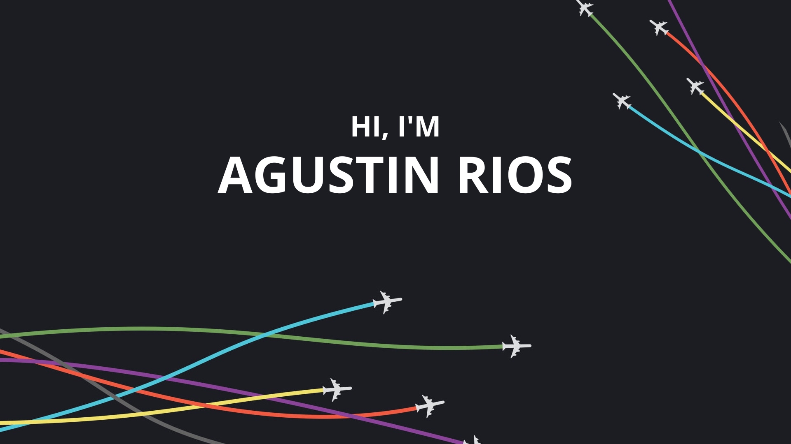
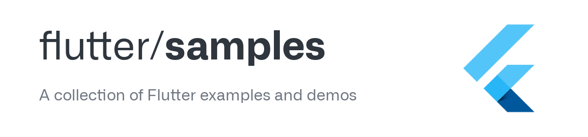

I’m Agustin, a mobile developer, creative coder and self-proclaimed designer who specializes in front-end development. I make it my mission to translate user-focused designs into pixel-perfect websites or applications that run blazing fast.

Want to know more about me? [Check out my portfolio.](https://agustinfruni.wordpress.com/)

<h3 align="center">A passionate developer from Argentina</h3>

<h3 align="left">Connect with me:</h3>

<h3 align="left"></h3>

<h3 align="left">Languages and Tools:</h3>

      

[#Here are some of my flutter samples](https://github.com/AgustinFRUni/flutter-samples/tree/main)

<!--

**AgustinFRUni/AgustinFRUni** is a ✨ _special_ ✨ repository because its `README.md` (this file) appears on your GitHub profile.

Here are some ideas to get you started:

- 🔭 I’m currently working on ...
- 🌱 I’m currently learning ...
- 👯 I’m looking to collaborate on ...
- 🤔 I’m looking for help with ...
- 💬 Ask me about ...
- 📫 How to reach me: ...
- 😄 Pronouns: ...
- ⚡ Fun fact: ...
-->
